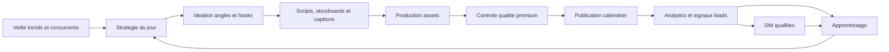

# Agent marketing IA BYL

Ce dossier decrit le socle de l'agent marketing autonome BoostYourLife. Il sert de reference commune pour les automations quotidiennes, le dashboard social et les futures integrations IA.

Objectif principal: maximiser les essais gratuits de 14 jours pour coachs sportifs, dieteticiens, nutritionnistes, salles de sport et structures de coaching, sans transformer la marque en usine a contenu generique.

Le fonctionnement v2 executable est documente dans `MARKETING_AGENT_V2.md`: Trend Scout, Strategy Lead, Concept Builder, Creative Director, Preflight Gate, Publisher et Analyst. Cette version produit un plan agent quotidien dans `campaigns/<date>-agent-plan.json` avant toute production/publication. La commande principale est `npm run social:agent:autopilot`, qui lance le cycle autonome complet en dry-run et ecrit l'etat dans `autopilot-state.json`.

Regle video: BYL ne depend pas d'un flux humain fourni manuellement. Par defaut, sans Pippit/CapCut/Sora/provider externe, l'agent utilise `byl_autonomous`: il cree un MP4 produit vertical avec mouvement, inserts app, voix off, musique discrete, overlays et CTA. Un provider `real_video` reste une amelioration premium quand il est disponible, mais l'agent doit deja fonctionner sans lui et bloquer seulement les rendus faibles, muets, recycles ou non publiables.

## Positionnement

BoostYourLife doit etre presente comme une plateforme premium qui aide les professionnels a quitter Excel, Sheets, PDF, WhatsApp et les suivis disperses pour passer a une experience plus claire, plus fluide et plus professionnelle.

Promesse centrale:

- gagner du temps chaque semaine;
- centraliser programmes, nutrition, progression, notes et relances;
- professionnaliser l'experience client;
- aider les coachs et structures a scaler sans perdre la qualite du suivi;
- convertir plus de prospects vers l'essai gratuit de 14 jours.

## Architecture globale

Le systeme doit fonctionner par boucle:

1. analyser les tendances et signaux du marche;
2. choisir un angle coherent avec le calendrier;
3. creer le contenu;
4. publier au bon moment;
5. mesurer;
6. apprendre;
7. ajuster les prochains contenus.

## Agents specialises

| Agent | Role | Sortie attendue |
| --- | --- | --- |
| Trend Scout | Analyse trends, hooks, sons, formats, concurrents | Notes quotidiennes, opportunites, formats a tester |
| Strategy Lead | Choisit l'angle du jour selon calendrier + objectifs | Brief de contenu, persona, promesse, CTA |
| Creative Director | Garde le niveau premium et evite le rendu IA generique | Direction visuelle, storyboard, contraintes qualite |
| Scriptwriter | Ecrit hooks, scripts voix off, sous-titres, captions | Variantes A/B par plateforme |
| Video Producer | Prepare scenes, prompts video, plans, exports | Brief video, assets, formats 9:16/1:1 |
| Publisher | Publie ou prepare selon statut des connecteurs | Posts, stories, reels, logs de publication |
| Analyst | Lit les stats et detecte les gagnants | Rapport performance, hypotheses, actions |
| Lead Qualifier | Identifie les prospects DM autorises | Liste qualifiee, raison du contact, message propose |

## Stack recommandee

MVP local:

- Dashboard social existant dans `ad-samples/social-publisher`.
- Donnees campagne JSON dans `campaigns/`.
- Automations Codex pour veille, preparation et publication.
- Meta Graph API pour Facebook/Instagram.
- TikTok Content Posting API apres validation TikTok.
- Stockage local d'abord, puis base Postgres/Supabase si le volume augmente.

IA contenu:

- LLM pour veille, scripts, captions, scoring qualite, analyse performance.
- Sora / Veo / Runway / Kling pour scenes video realistes selon disponibilite, cout et qualite.
- ElevenLabs ou OpenAI TTS pour voix off premium.
- CapCut/Runway/FFmpeg pour montage, sous-titres, formats et exports.

Stack scalable a moyen terme:

- Queue de jobs: BullMQ, Trigger.dev ou Temporal.
- Stockage assets: Cloudflare R2 ou S3.
- DB: Postgres avec tables `content_items`, `experiments`, `platform_posts`, `daily_trends`, `lead_signals`.
- Analytics: collecte Meta/TikTok + dashboard interne.
- Observabilite: logs par run, erreurs connecteurs, couts IA, taux de publication.

## Pipeline contenu

1. Trend Scout produit une note du jour: trend, pourquoi elle marche, adaptation BYL.
2. Strategy Lead choisit un angle du calendrier: douleur, retention, nutrition, club/studio, preuve produit.
3. Scriptwriter genere 3 variantes:
   - hook direct;
   - hook storytelling;
   - hook business/resultat.
4. Creative Director selectionne la meilleure direction selon la grille qualite.
5. Video Producer cree ou assemble les assets.
6. Publisher prepare les publications avec captions, hashtags, CTA et plateformes.
7. Analyst compare les performances apres 24h, 72h et 7 jours.

## Regles de decision senior

Le calendrier editorial est une contrainte de diffusion, pas une obligation de publier. Si un contenu ne depasse pas les seuils qualite et conversion, l'agent doit regenerer, changer l'angle, changer le hook, changer le storytelling, changer le CTA ou reporter la publication. L'objectif est la performance, jamais le remplissage.

Avant chaque contenu, le moteur repond silencieusement a sept questions: pourquoi regarder, pourquoi rester, pourquoi cliquer, pourquoi tester BoostYourLife, quel probleme reel est resolu, quelle emotion est declenchee, et quel benefice est compris en moins de trois secondes. Si ces reponses sont faibles, le contenu est rejete.

Le produit ne doit pas apparaitre avant que le probleme soit ressenti. L'ordre prioritaire est:

1. emotion;
2. identification;
3. probleme reel;
4. storytelling;
5. demonstration produit.

Le KPI principal est `free_trial_starts`. Le KPI secondaire est `activation_day_7`: un essai gratuit doit devenir un utilisateur actif, sinon le contenu a attire de la curiosite faible qualite.

Activation J+7 mesure notamment:

- creation d'un client;
- creation d'un programme;
- assignation d'un programme;
- connexion d'un client.

Les vues, likes, commentaires et partages servent de signaux secondaires, mais ils ne pilotent pas la decision finale.

## Segments d'audience

L'agent ne doit pas parler a tout le monde dans le meme contenu. Il choisit un segment principal:

- `coach_independant`: perte de temps, Excel, WhatsApp, relances, suivi client disperse;
- `nutritionniste`: suivi alimentaire, plans nutritionnels, adherence;
- `salle_de_sport`: gestion equipe, suivi coachs, standardisation.

Si un contenu melange les trois marches, il est considere trop large: il risque de ne parler a personne.

## Score conversion

En plus du score qualite, chaque publication recoit un `conversionScore` sur 100, base sur:

- hook;
- emotion;
- preuve;
- CTA;
- storytelling;
- differenciation.

Publication interdite si `conversionScore < 80`, meme si le rendu visuel est bon. Le dashboard et les runners retournent alors `marketing_strategy_blocked`.

## Memoire marketing

La base `marketing-memory.json` conserve pour chaque contenu publie:

- hook;
- theme;
- angle;
- CTA;
- emotion;
- performance;
- plateforme;
- date;
- audience.

Avant toute creation, l'agent consulte cette memoire et evite repetitions, recyclages et saturation d'un angle. La base `growth-memory.json` est mise a jour par le rapport de croissance avec les meilleurs hooks, videos, CTA, formats, horaires, emotions, audiences et activations J+7.

La base centrale `marketing-knowledge.json` consolide:

- tous les hooks;
- tous les CTA;
- tous les resultats;
- toutes les audiences et segments;
- toutes les objections;
- toutes les preuves;
- tous les tests;
- toutes les performances.

Elle sert de memoire unique pour que le systeme devienne meilleur chaque semaine, pas seulement plus productif.

## Apprentissage operationnel

L'agent doit aussi apprendre de ses erreurs d'exploitation, pas seulement des performances marketing.

Quand une publication ou une automation echoue apres avoir ete annoncee comme prete, l'agent doit enregistrer l'incident, isoler le chemin reel utilise par le scheduler, puis ajouter un garde-fou avant de conclure que le systeme est fiable.

Regle bloquante avant toute affirmation "tout va fonctionner":

- verifier que le media frais du jour existe et passe le controle qualite;
- verifier le dry-run du meme chemin que celui utilise par le scheduler local;
- verifier que le connecteur de la plateforme est autorise et publiable;
- verifier que la fenetre calendrier locale est active et que le scheduler repond;
- distinguer clairement un blocage contenu, un blocage media, un blocage API et un blocage horaire.

Les incidents et corrections sont consignes dans `operational-learning-log.jsonl`. Une correction ponctuelle ne suffit pas: elle doit devenir une regle de diagnostic reutilisable.

## Fatigue, preuves et objections

Un angle peut etre gagnant puis s'user. Le `fatigueScore` observe frequence d'utilisation, baisse CTR, baisse watch time, baisse conversion et baisse activation. Si le seuil est atteint, l'angle est mis en pause.

La `proof-library.json` stocke temoignages, gains de temps, captures, statistiques et transformations. La `objection-database.json` classe les objections en prix, complexite, confiance, migration, IA, securite et temps. Les prochains contenus doivent repondre a ces objections avec des preuves concretes.

## Brand Score et kill switch

Le `brandScore` estime si BYL parait premium, serieux, innovant et fiable. Les commentaires et conversations peuvent alimenter ce score.

Le `kill-switch.json` desactive la publication automatique en cas de bug API, mauvais prompt, generation etrange, comportement spam ou publication incoherente. Quand il est actif, le dashboard peut encore preparer et analyser, mais il ne publie plus automatiquement sans intervention.

## Systeme d'experimentation

La repartition cible est:

- 70% contenus prouves;
- 20% optimisations;
- 10% experimentations.

Le systeme detecte les faux succes: 500 000 vues sans essai gratuit est un echec; 5 000 vues avec 30 essais et activation J+7 est un succes.

## Trends et concepts originaux

80% du contenu peut s'inspirer de tendances ou de mecaniques deja identifiees. 20% doit tester des concepts originaux jamais publies. Ces concepts sont marques comme `original_concept_test` et mesures separement.

## Regles creatives

Le contenu doit sembler humain, premium et credible.

La diversite creative est une regle bloquante. Le systeme detaille est dans:

- `CREATIVE_DIVERSITY_SYSTEM.md`

A faire:

- partir d'une situation business ou emotionnelle concrete;
- montrer du mouvement reel: gestes, ordinateur, client, carnet, salle, ecran, scroll, montage;
- garder une direction visuelle sobre, claire, moderne;
- utiliser BYL comme solution naturelle, pas comme publicite agressive;
- ajouter une preuve produit courte quand elle renforce l'histoire.

A eviter:

- faux temoignages clients;
- avatars IA cheap;
- voix robotiques;
- mouvements incoherents;
- textes marketing generiques;
- transitions excessives;
- hooks vus partout;
- storytelling artificiel;
- promesses irrealistes;
- fond photo + texte comme format principal;
- promesses medicales ou resultats garantis;
- copier une trend ou un concurrent;
- spam de publications ou DM.

## Publication

Le calendrier source reste:

- `../CONTENT_CALENDAR.md`

Regle actuelle:

- Instagram et Facebook: publication possible si connecteurs operationnels et media compatible.
- TikTok: preparation du contenu, publication seulement apres validation app + scope approuve.
- Instagram Reels: media public HTTPS obligatoire.
- Facebook: publication via Page.
- Les publications ne doivent pas partir a une heure fixe unique tous les jours. Les automations de publication suivent les creneaux variables du calendrier editorial: jour, heure, plateforme et format.
- Si une automation se declenche sur un creneau sans contenu prevu, elle ne publie rien et indique seulement ce qui a ete prepare ou reporte.

Notification utilisateur:

- si une publication reelle est effectuee, l'agent doit prevenir Tom dans son compte rendu;
- la notification doit commencer par `PUBLICATION BYL`;
- elle doit inclure plateforme, format, titre/angle, heure, lien ou ID de publication si disponible, et point de controle rapide;
- si rien n'est publie et que le contenu est seulement prepare, l'agent doit l'indiquer clairement sans utiliser `PUBLICATION BYL`.

## Intelligence marketing

Chaque contenu doit etre rattache a un objectif:

- essai gratuit;
- clic lien bio/site;
- message prive;
- sauvegarde;
- partage;
- commentaire qualifie;
- preuve de credibilite.

KPIs a suivre:

- retention video 3s, 50%, completion;
- vues qualifiees;
- taux de clic;
- commentaires de coachs/pros;
- messages entrants;
- essais gratuits;
- cout IA par asset;
- temps de production;
- posts reutilisables.

## Apprentissage

L'agent doit tenir une memoire d'experiences:

- hook;
- persona;
- douleur;
- format;
- duree;
- plateforme;
- heure;
- CTA;
- resultat;
- conclusion.

Un contenu gagnant doit etre reutilise de 3 facons:

1. meme angle, nouveau persona;
2. meme hook, nouvelle situation;
3. meme contenu transforme en carrousel, reel, story ou post Facebook.

## DM intelligents

Les DM ne sont autorises que pour les leads qualifies. La politique complete est dans:

- `DM_POLICY.md`

Principe: conversation naturelle, faible volume, aucun spam, aucun message trompeur.

## Decisions automatiques ou non

Automatique:

- veille quotidienne;
- preparation des scripts, captions, hashtags, stories;
- scoring qualite;
- choix des variantes a tester quand le calendrier est clair;
- publication des posts approuves par les regles de securite;
- analyse des performances.

Validation utilisateur requise:

- changement majeur de positionnement;
- budget publicitaire;
- nouvel outil payant couteux;
- DM a gros volume;
- promesses commerciales sensibles;
- changement de prix/offre;
- publication d'un contenu qui utilise un faux temoignage ou une revendication forte.

## Roadmap MVP

Phase 1: socle editorial et process

- Playbook agent.
- Config agents.
- Politique DM.
- Calendrier enrichi.
- Automations quotidiennes alignees.

Phase 2: generation semi-auto

- Generer un brief quotidien.
- Produire scripts + captions + storyboards.
- Creer fichiers campagne JSON par semaine.
- Ajouter un journal d'apprentissage.

Phase 3: publication et analytics

- Recuperer les stats Meta.
- Ajouter statut TikTok apres review.
- Connecter les performances au journal d'experiences.
- Ajuster horaires, hooks et formats.

Phase 4: production video scalable

- Pipeline video IA/stock/produit.
- Exports multi-format.
- Sous-titres automatiques.
- Variantes A/B.

## Estimation temps

MVP operationnel local: 2 a 4 jours de travail.

Version vraiment autonome avec analytics, apprentissage et production video robuste: 2 a 4 semaines.

Version scalable type agence interne: 6 a 10 semaines selon integrations, budgets IA et validation plateformes.

## Cout estime

MVP leger: 50 a 150 EUR/mois.

Production video reguliere: 150 a 600 EUR/mois.

Production intensive premium: 800 EUR/mois et plus, surtout si generation video IA longue, voix premium et beaucoup de variantes.

## Risques techniques

- validations Meta/TikTok variables;
- cout video IA;
- rendu IA trop identifiable;
- droits musicaux et trends;
- limites API;
- besoin d'URLs publiques pour Instagram;
- risque de spam si DM mal controles.

## Recommandation strategique

Ne pas commencer par publier beaucoup. Commencer par publier mieux:

- 3 videos fortes par semaine;
- 2 carrousels utiles;
- stories regulieres;
- 1 analyse hebdomadaire;
- 1 declinaison des contenus gagnants.

Le volume augmente seulement si la qualite, la cadence et la mesure sont stables.
